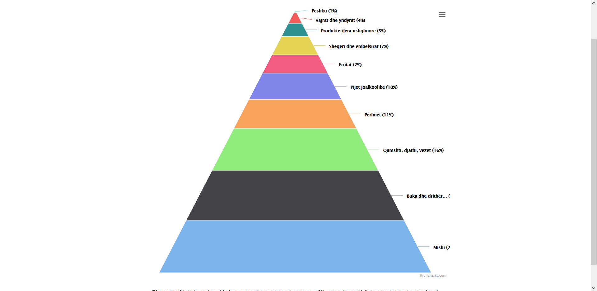

This website shows three different graph representation of open data taken from Kosovo's Agency of statistics. The data are food statistics for ten food categories (meat, fish, fruits, etc.) taken in four consecutive years, 2011 - 2014. There are three types of graphs implemented in Javascript's framework called <i>Highcharts</i>. 

  

One graph is the stacked graph which showing the consumption distribution (in percentage) for ten categories of food in all the years:

  

Another type of graph is the pyramid graph showing the consumption distribution (in percentage) in a year of the ten categories of food:

  

And the last graph type is the dual axes graph, which compares the change of consumption to the avarage price for a particular category of food:

 <i>This website in developed in Albanian</i>
